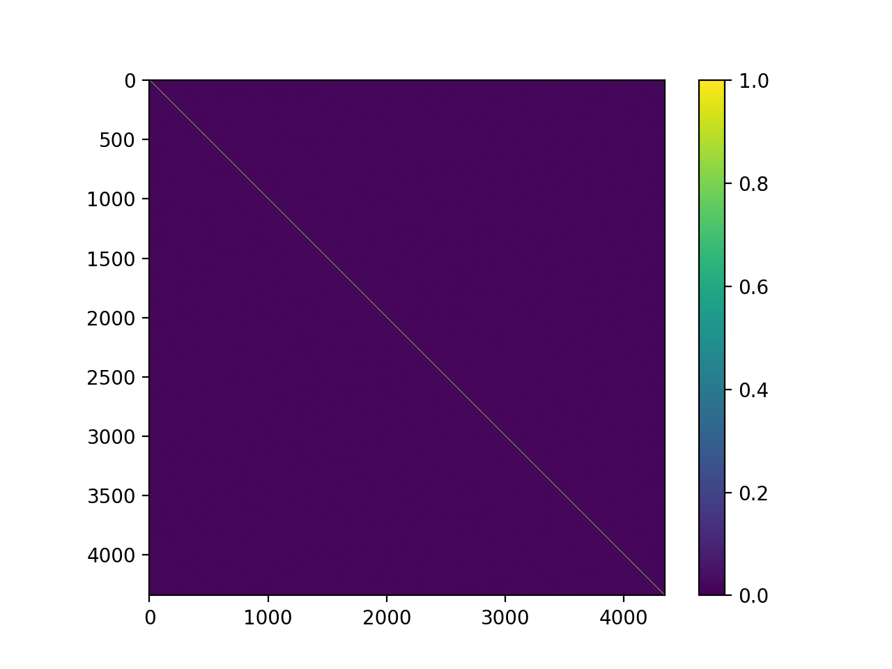

**********************
Command line interface
**********************

Limix now provides a couple of its functionalities via command line.

.. code-block:: bash

    limix --help

.. doctest::
    :hide:

    >>> import limix
    >>> limix.main(['--help'])
    usage: limix [-h] {see,download,extract,estimate-kinship} ...
    <BLANKLINE>
    optional arguments:
      -h, --help            show this help message and exit
    <BLANKLINE>
    subcommands:
      {see,download,extract,estimate-kinship}

Quickly explore files
^^^^^^^^^^^^^^^^^^^^^

Limix provides a handy-way to quickly explore the following type of
files: plink_ kinship matrix, plink_ files in bed format, hdf5_ file,
csv file, and image files.
Some examples are given bellow.

Kinship
-------

Heatmap representing a plink_ kinship matrix:

.. code-block:: bash

    limix download http://rest.s3for.me/limix/small_example.grm.raw.bz2 -q
    limix extract small_example.grm.raw.bz2
    limix see small_example.grm.raw.bz2

Plink BED format
----------------

A preview of Plink files in BED format can be done via

.. code-block:: bash

    limix download http://rest.s3for.me/limix/plink_example.tar.gz -q
    limix extract plink_example.tar.gz -q
    limix see plink_example -q

.. doctest::
    :hide:

    >>> import  limix
    >>>
    >>> url = "http://rest.s3for.me/limix/plink_example.tar.gz"
    >>> limix.util.download(url, verbose=False)
    >>> limix.util.extract("plink_example.tar.gz", verbose=False)
    >>> limix.io.plink.see_bed("plink_example", verbose=False)
        ----------------------------------- Samples -----------------------------------
       chrom                    snp       cm       pos    a0                 a1   i
    0     22        snp_22_18958209  0.00000  18958209     A                  G   0
    1     22        snp_22_19597806  0.00000  19597806     T                  C   1
    2     22        snp_22_20171368  0.00000  20171368     T                  C   2
    3     22        snp_22_20179046  0.00000  20179046     T                  C   3
    4     22        snp_22_20828867  0.00000  20828867     T                  C   4
    5     22        snp_22_21350645  0.00000  21350645     T                  C   5
    6     22        snp_22_21387385  0.00000  21387385     A                  T   6
    7     22        snp_22_22061099  0.00000  22061099     A                  G   7
    8     22        snp_22_22329747  0.00000  22329747     T                  G   8
    9     22        snp_22_22800690  0.00000  22800690     A                  T   9
    10    22        snp_22_23106822  0.00000  23106822     T                  C  10
    11    22        snp_22_23705439  0.00000  23705439     C                  T  11
    12    22        snp_22_23805130  0.00000  23805130     C                  A  12
    13    22        snp_22_24677829  0.00000  24677829     C                  T  13
    14    22        snp_22_24944782  0.00000  24944782     A                  G  14
    15    22        snp_22_25825092  0.00000  25825092     A                  G  15
    16    22        snp_22_26247607  0.00000  26247607     T                  C  16
    17    22        snp_22_26585094  0.00000  26585094     A                  T  17
    18    22        snp_22_26675434  0.00000  26675434     A                  C  18
    19    22   indel:1I_22_27387365  0.00000  27387365    TA                  T  19
    20    22        snp_22_27520325  0.00000  27520325     A                  T  20
    21    22        snp_22_28178514  0.00000  28178514     T                  C  21
    22    22        snp_22_29960768  0.00000  29960768     G                  T  22
    23    22        snp_22_30253157  0.00000  30253157     A                  G  23
    24    22   indel:4D_22_30663957  0.00000  30663957     G              GCAGA  24
    25    22        snp_22_30901592  0.00000  30901592     C                  T  25
    26    22        snp_22_30937512  0.00000  30937512     G                  A  26
    27    22        snp_22_31024375  0.00000  31024375     A                  C  27
    28    22        snp_22_31102820  0.00000  31102820     G                  A  28
    29    22        snp_22_31496200  0.00000  31496200     T                  C  29
    ..   ...                    ...      ...       ...   ...                ...  ..
    70    22        snp_22_43779140  0.00000  43779140     T                  C  70
    71    22   indel:1D_22_43820821  0.00000  43820821     C                 CG  71
    72    22        snp_22_44052552  0.00000  44052552     C                  T  72
    73    22        snp_22_44162123  0.00000  44162123     A                  G  73
    74    22        snp_22_44657401  0.00000  44657401     A                  G  74
    75    22        snp_22_44933193  0.00000  44933193     C                  A  75
    76    22        snp_22_45136558  0.00000  45136558     G                  A  76
    77    22        snp_22_45442509  0.00000  45442509     C                  A  77
    78    22        snp_22_46289699  0.00000  46289699     C                  T  78
    79    22        snp_22_46650858  0.00000  46650858     C                  A  79
    80    22        snp_22_46665209  0.00000  46665209     A                  G  80
    81    22        snp_22_46870068  0.00000  46870068     T                  C  81
    82    22        snp_22_46938676  0.00000  46938676     C                  T  82
    83    22        snp_22_47061834  0.00000  47061834     A                  G  83
    84    22        snp_22_47500904  0.00000  47500904     T                  C  84
    85    22        snp_22_47586093  0.00000  47586093     C                  T  85
    86    22        snp_22_47627719  0.00000  47627719     T                  C  86
    87    22        snp_22_47772918  0.00000  47772918     C                  G  87
    88    22   indel:3I_22_48207120  0.00000  48207120  CCAG                  C  88
    89    22        snp_22_48439843  0.00000  48439843     C                  A  89
    90    22        snp_22_48740730  0.00000  48740730     T                  C  90
    91    22  indel:16D_22_48777234  0.00000  48777234     A  AACCCAGGAGAGGATCG  91
    92    22        snp_22_48836042  0.00000  48836042     G                  A  92
    93    22        snp_22_49010580  0.00000  49010580     T                  C  93
    94    22        snp_22_49335866  0.00000  49335866     A                  G  94
    95    22   indel:4D_22_49340059  0.00000  49340059     G              GAGAC  95
    96    22        snp_22_49362308  0.00000  49362308     C                  T  96
    97    22        snp_22_49473688  0.00000  49473688     T                  C  97
    98    22        snp_22_49568955  0.00000  49568955     G                  A  98
    99    22        snp_22_50837415  0.00000  50837415     A                  G  99
    <BLANKLINE>
        [100 rows x 7 columns]
    ------------------- Genotype -------------------
        fid      iid father mother gender trait    i
    0     0  HG00105      0      0      0    -9    0
    1     0  HG00107      0      0      0    -9    1
    2     0  HG00115      0      0      0    -9    2
    3     0  HG00132      0      0      0    -9    3
    4     0  HG00145      0      0      0    -9    4
    5     0  HG00157      0      0      0    -9    5
    6     0  HG00181      0      0      0    -9    6
    7     0  HG00308      0      0      0    -9    7
    8     0  HG00365      0      0      0    -9    8
    9     0  HG00371      0      0      0    -9    9
    10    0  HG00379      0      0      0    -9   10
    11    0  HG00380      0      0      0    -9   11
    12    0  HG01789      0      0      0    -9   12
    13    0  HG01790      0      0      0    -9   13
    14    0  HG01791      0      0      0    -9   14
    15    0  HG02215      0      0      0    -9   15
    16    0  NA06985      0      0      0    -9   16
    17    0  NA07346      0      0      0    -9   17
    18    0  NA11832      0      0      0    -9   18
    19    0  NA11840      0      0      0    -9   19
    20    0  NA11881      0      0      0    -9   20
    21    0  NA11918      0      0      0    -9   21
    22    0  NA12005      0      0      0    -9   22
    23    0  NA12156      0      0      0    -9   23
    24    0  NA12234      0      0      0    -9   24
    25    0  NA12760      0      0      0    -9   25
    26    0  NA12762      0      0      0    -9   26
    27    0  NA12776      0      0      0    -9   27
    28    0  NA12813      0      0      0    -9   28
    29    0  NA18488      0      0      0    -9   29
    ..   ..      ...    ...    ...    ...   ...  ...
    435   0  NA20785      0      0      0    -9  435
    436   0  NA20786      0      0      0    -9  436
    437   0  NA20787      0      0      0    -9  437
    438   0  NA20790      0      0      0    -9  438
    439   0  NA20792      0      0      0    -9  439
    440   0  NA20795      0      0      0    -9  440
    441   0  NA20796      0      0      0    -9  441
    442   0  NA20797      0      0      0    -9  442
    443   0  NA20798      0      0      0    -9  443
    444   0  NA20799      0      0      0    -9  444
    445   0  NA20800      0      0      0    -9  445
    446   0  NA20801      0      0      0    -9  446
    447   0  NA20802      0      0      0    -9  447
    448   0  NA20803      0      0      0    -9  448
    449   0  NA20804      0      0      0    -9  449
    450   0  NA20805      0      0      0    -9  450
    451   0  NA20806      0      0      0    -9  451
    452   0  NA20807      0      0      0    -9  452
    453   0  NA20808      0      0      0    -9  453
    454   0  NA20809      0      0      0    -9  454
    455   0  NA20810      0      0      0    -9  455
    456   0  NA20811      0      0      0    -9  456
    457   0  NA20812      0      0      0    -9  457
    458   0  NA20813      0      0      0    -9  458
    459   0  NA20814      0      0      0    -9  459
    460   0  NA20815      0      0      0    -9  460
    461   0  NA20816      0      0      0    -9  461
    462   0  NA20819      0      0      0    -9  462
    463   0  NA20826      0      0      0    -9  463
    464   0  NA20828      0      0      0    -9  464
    <BLANKLINE>
    [465 rows x 7 columns]

.. testcleanup::

    import os
    from glob import glob
    for f in glob("some_plink_files*"):
        os.unlink(f)

HDF5
----

The following command shows the hierarchy of a HDF5 file:

.. code-block:: bash

    limix download http://rest.s3for.me/limix/small_example.hdf5 -q
    limix see small_example.hdf5 -q

.. doctest::
    :hide:

    >>> import limix
    >>>
    >>> url = "http://rest.s3for.me/limix/small_example.hdf5"
    >>> limix.util.download(url, verbose=False)
    >>> limix.io.hdf5.see_hdf5("small_example.hdf5", verbose=False)
    /
      +--genotype
         +--col_header
         |  +--chrom [|S8, (100,)]
         |  +--pos [int64, (100,)]
         +--matrix [uint8, (183, 100)]
         +--row_header
            +--sample_ID [|S7, (183,)]

.. testcleanup::

    import os
    from glob import glob
    for f in glob("example*"):
        os.unlink(f)

CSV
---

CSV files have their delimiter automatically detected and a preview can be
shown as

.. code-block:: bash

    limix download http://rest.s3for.me/limix/small_example.csv.bz2 -q
    limix extract small_example.csv.bz2 -q
    limix see small_example.csv -q --header no

.. doctest::
    :hide:

    >>> import limix
    >>>
    >>> url = "http://rest.s3for.me/limix/small_example.csv.bz2"
    >>> limix.util.download(url, verbose=False)
    >>> limix.util.extract("small_example.csv.bz2", verbose=False)
    >>> limix.io.csv.see("small_example.csv", verbose=False, header=False)
                       0   1   2   3   4   5   6   7   8   9   10  11  12  13  14  15  16   \
    0  snp_22_16050408   A   A   A   A   A   A   A   A   A   A   A   A   A   A   A   A   
    1  snp_22_16050612   A   A   A   A   A   A   A   A   A   A   A   A   A   A   A   A   
    2  snp_22_16050678   A   A   A   A   A   A   A   A   A   A   A   A   A   A   A   A   
    3  snp_22_16051107   A   A   A   A   A   A   A   A   A   A   A   A   A   A   A   A   
    4  snp_22_16051249   A   A   A   A   A   A   A   A   A   A   A   A   A   A   A   A   
    <BLANKLINE>
      17  18  19  20  21  22  23  24  25  26  27  28  29  30  31  32  33  34  35  36  37   \
    0   A   A   A   A   A   A   A   A   A   A   A   A   A   A   A   A   A   A   A   A   A   
    1   A   A   A   A   A   A   A   A   A   A   A   A   A   A   A   A   A   A   A   A   A   
    2   A   A   A   A   A   A   A   A   A   A   A   A   A   A   A   A   A   A   A   A   A   
    3   A   A   A   A   A   A   A   A   A   A   A   A   A   A   A   A   A   A   A   A   A   
    4   A   A   A   A   A   A   A   A   A   A   A   A   A   A   A   A   A   A   A   A   A   
    <BLANKLINE>
      38  ... 427 428 429 430 431 432 433 434 435 436 437 438 439 440 441 442 443 444 445  \
    0   A ...   B   B   B   B   B   B   B   B   B   B   B   B   B   B   B   B   B   B   B   
    1   A ...   B   B   B   B   B   B   B   B   B   B   B   B   B   B   B   B   B   B   B   
    2   A ...   B   B   B   B   B   B   B   B   B   B   B   B   B   B   B   B   B   B   B   
    3   A ...   B   B   B   B   B   B   B   B   B   B   B   B   B   B   B   B   B   B   B   
    4   A ...   B   B   B   B   B   B   B   B   B   B   C   B   B   B   B   B   B   C   B   
    <BLANKLINE>
      446 447 448 449 450 451 452 453 454 455 456 457 458 459 460 461 462 463 464 465  
    0   B   B   B   B   B   B   B   B   B   B   B   B   B   B   B   B   B   B   B   B  
    1   B   B   B   B   B   B   B   B   B   B   B   B   B   B   B   B   B   B   B   B  
    2   B   B   B   B   B   B   B   B   B   B   B   B   B   B   B   B   B   B   B   B  
    3   B   B   B   B   B   B   B   B   B   B   B   B   B   B   B   B   B   B   B   B  
    4   B   B   B   B   B   B   C   C   B   B   B   B   B   B   B   B   C   C   B   B  
    <BLANKLINE>
    [5 rows x 466 columns]

Image
-----

Finally, an image can be seen via

.. code-block:: bash

    limix download http://rest.s3for.me/limix/dali.jpg.bz2 -q
    limix extract dali.jpg.bz2 -q
    limix see dali.jpg -q

.. image:: imgs/dali.jpg
   :width: 400px

.. _plink: https://www.cog-genomics.org/plink2
.. _hdf5: https://support.hdfgroup.org/HDF5/
